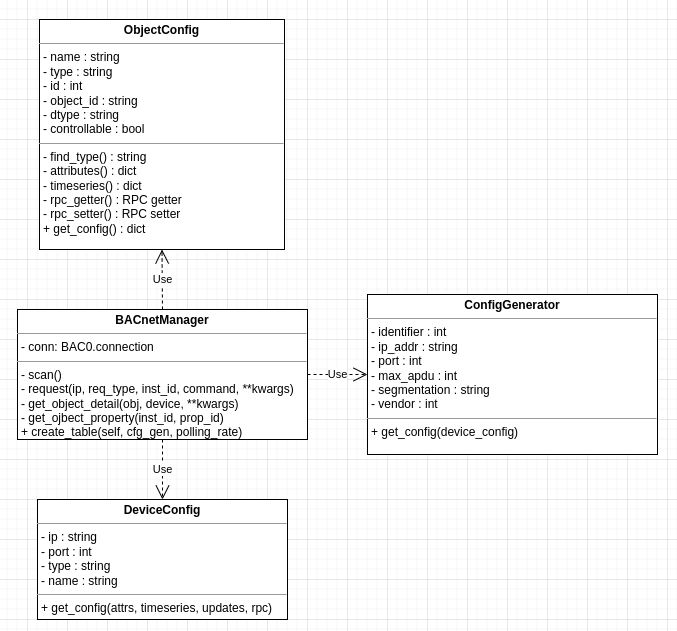
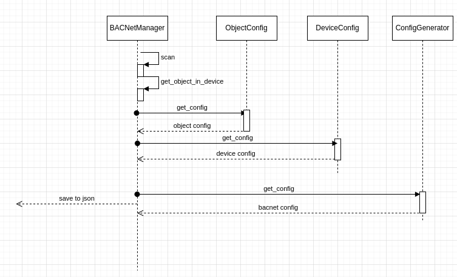

# bacnet-configurator
bacnet config file generator for thingsboard-gateway
--------
### 의존성 설치
```bash
$ python3 -m pip install -r requirements
```
--------
### 사용법
```bash
$ python3 bac_conf.py --ip_addr='your.ipv4.bacnet.addr' --subnet=24 --port=47808
```   
* ip_addr : string =  BACnet Interface의 IPV4 주소 
* subnet : integer = BACnet Interface network의 subnet mask 지정 기본 24
* port : integer = BACnet Interface의 통신 포트 기본 47808 
* output : bacnet.json 출력(thingsboard iot gateway 의 config 폴더에 넣고 사용)
------
```bash 
# this is beta
$ python3 converter.py --mapping_table=LUT.csv --config bacnet.json
```
### 구성도
* 클래스 다이어그램
  
---
* 시퀀스 다이어그램
  
---
* Class 역할
  - BACNetManager : BACnet 에 속한 게이트웨이들을 탐색하고, 게이트웨이 개별에 속한 장치를 탕색한다. 각 장치의 오브젝트 탐색한다.
  - ObjectConfig : BACNetManager 가 수집한 object 의 데이터를 통해 object config 을 구성한다.
  - DeviceConfig : BACNetManager가 수집한 object config 을 device 별로 저장하여 DeviceConfig을 구성한다.
  - ConfigGenerator : BACNetManager 에서 최종적으로 구성한 DeviceConfig 을 바탕으로 Thingsboard IoT Gateway 의 bacnet.json 파일을 생성한다.
## 산출물 예시
```json
{
    "general": { // ConfigGenerator의 생성자 변수들
        "objectName": "TB_gateway",
        "address": "0.0.0.0:47808",
        "objectIdentifier": 1476,
        "maxApduLengthAccepted": 1476,
        "segmentationSupported": "segmentedBoth",
        "vendorIdentifier": 15
    },
    "devices" : [
        {    
            //DeviceConfig에 의해 생성됨
            "deviceName": "BACnet Device ${objectName}",
            "deviceType": "default",
            "address": "192.168.0.17:47808",
            "pollPeriod": 10000,
            // 이하 attributes, timeseries... 등은 모두 ObjectConfig에 의해 생성됨
            "attributes": [   
                {                 
                    "key": "BO2015",
                    "type": "string",
                    "objectId": "binaryOutput:2015",
                    "propertyId": "description"
                }
            ],
            "timeseries": [{
                "key": "AO2218",
                "type": "double",
                "objectId": "analogOutput:2218",
                "propertyId": "presentValue"
            }],
            "serverSideRpc" : [],
            "clientSideRpc" : []
        }
    ]
}
```

### Limits
* 재귀탐색 미구현 : Root Gateway 밑 Gateway 에 또다른 하위 Gateway가 있을 경우 탐색 하지 않음.
------
### Dependencies
* BAC0==21.12.3
* bacpypes==0.18.6
* certifi==2022.5.18.1
* charset-normalizer==2.0.12
* colorama==0.4.4
* idna==3.3
* pytz==2022.1
* urllib3==1.26.9
* requests>=2.24.0

